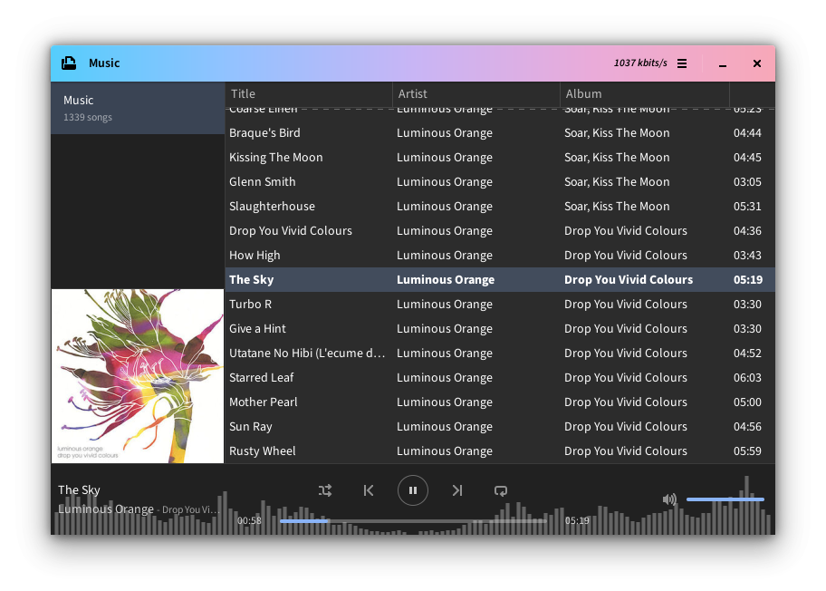

# aqours

A playlist-oriented music player. This music player is a work-in-progress, so it
will be missing many needed features, such as adding and removing songs, as well
as containing many bugs.

## Dependencies

- gtk3
- mpv
- ffmpeg
- Building without tag `nocatnip` (visualizer):
	- parec or portaudio or ffmpeg
	- fftw
